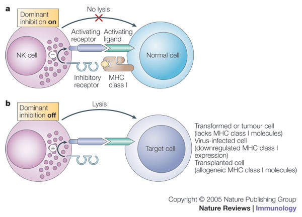
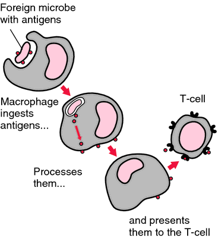
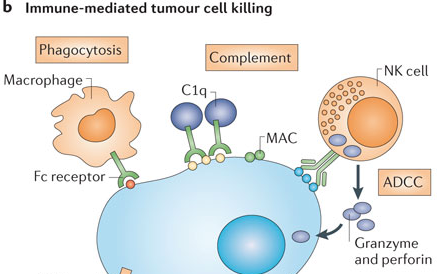
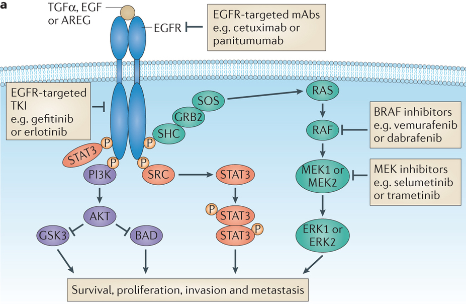

```{r setup, include=FALSE}
knitr::opts_chunk$set(echo = FALSE, message = FALSE, fig.align = 'center', out.width = '70%')
library(tidyverse)
```

---
class:inverse, middle, center

## Immuunsus

---
## Adaptiivne immuunsus

```{r}
knitr::include_graphics("http://intranet.tdmu.edu.ua/data/kafedra/internal/patologanatom/classes_stud/en/med/lik/ptn/Pathomorphology/3/04_Pathomorph_immune_syst.files/image008.png")
```


---
## NK rakud ja makrofaagid

.pull-left[
```{r, out.width='110%'}

```
]

.pull-right[
```{r}

```
]
---

## T rakud

- Helper T rakud (Th) on CD4+ ja vahendavad Tc ja B rakkude aktivatsiooni.
- Tsütotoksilised T rakud (Tc) on CD8+ ja vahendavad patogeenide ja nakatunud rakkude eemaldamist.
- Regulatoorsed T rakud (CD4+CD25+) supresseerivad Th ja Tc rakke, kontrollivad autoimmuunsust.

```{r}
knitr::include_graphics("https://ka-perseus-images.s3.amazonaws.com/95c73f88aa68932b0637224f6670208006c5e079.svg")
```

.footer[
Pilt: [khanacademy.org](https://www.khanacademy.org/test-prep/mcat/organ-systems/the-immune-system/a/adaptive-immunity)
]

---

## Koesobivusantigeenid

.pull-left[

**a**) MHC klass I molekulid presenteerivad enda antigeene.
**b**) Rakud millel MHC I puudub või    
**c**) rakud mis ei presenteeri enda antigeeni lüüsitakse tsütotoksiliste rakkude poolt.

```{r}
knitr::include_graphics("https://cdn.rcsb.org/pdb101/motm/images/1hsa-1dlh.gif")
```

Vasakul, MHC I; paremal, MHC II. Joonis: [PDB101](http://pdb101.rcsb.org/motm/62).

]

.pull-right[

```{r}
knitr::include_graphics("http://www.nature.com/nri/journal/v5/n5/images/nri1603-f1.jpg")
```

]

---

## Antikehad

- Fc retseptoreid ekspresseerivad rakud - NK rakud ja makrofaagid seovad antikehadega kaetud raku ja tapavad selle
- komplement seostub rakule seostunud antikehadele ja tapab raku muutes selle membraani poorseks 

```{r, out.width='60%'}

```

---

## Tsütotoksilised T rakud

```{r}
knitr::include_graphics("http://www.nature.com/nri/journal/v10/n8/images/nri2803-f2.jpg")
```

```{r, out.width='50%'}
knitr::include_graphics("http://faculty.southwest.tn.edu/rburkett/A&P2%20L44.jpg")
```

---
## Regulatoorsed T rakud

```{r}
knitr::include_graphics("http://www.nature.com/nri/journal/v11/n2/images/nri2916-f1.jpg")
```

---
class:inverse, middle, center

# Vähi immuunsus ja immuunoteraapia

---

## Vähi immuunoseire
*Cancer immunosurveillance*

- $1909$. aastal oletas saksa-juudi päritolu arst [Paul Ehrlich](http://en.wikipedia.org/wiki/Paul_Ehrlich) (1854-1915) et immuunsüsteem hoiab ära kartsinoomide tekke, mis vastasel juhul oleksid palju sagedasemad.
- Vähi immuunoseire hüpotees oletas, et tüümusest pärit rakud monitoorivad keha kudedes ka uusi transformeerunud rakke [Frank Macfarlane Burnet, 1970](http://www.ncbi.nlm.nih.gov/pubmed/4921480).

.pull-left[

```{r, out.width='50%'}
knitr::include_graphics("https://upload.wikimedia.org/wikipedia/commons/thumb/0/05/Paul_Ehrlich_1915.jpg/800px-Paul_Ehrlich_1915.jpg")
```

]

.pull-right[

```{r, out.width='50%'}
knitr::include_graphics("http://upload.wikimedia.org/wikipedia/commons/thumb/5/5b/Frank_Macfarlane_Burnet.jpg/800px-Frank_Macfarlane_Burnet.jpg")
```
]

.footer[
Pilt: wikipedia.
]

---

## Vähirakkudega ei saa nakatada
Vähirakud saavad moodustada uue vähi ainult geneetiliselt identses backgroundis, vastasel juhul nad hävitatakse immuunsüsteemi poolt 

```{r}
knitr::include_graphics("http://4.bp.blogspot.com/-WHsdxWMPQtw/VUvT0BwFECI/AAAAAAAABXI/s3bBD7j9DM8/s1600/PicsArt_1431032190753.jpg")
```

.footer[
Pilt:["Allogeneic IgG combined with dendritic cell stimuli induce antitumour T-cell immunity"](http://www.nature.com/nature/journal/v521/n7550/full/nature14424.html) 
]

---

## Vähi immuunokujundamine
*Cancer immunoediting*

- Vähi **täielik elimineerimine immuunsüsteemi poolt** on immuunokujundamise üks stsenaarium

- Teine stsenaarium on **immuunsüsteemi poolt kujundatud vähirakkude** repertuaari esiletõus

- Immuunsüsteemiga kohandunud vähirakud on kas 
  - **vähem immuunogeneesed**,
  - suurenenud **võimega inhibeerida vähivastast immuunvastust**

---

## Vähi immuunoseire/-kujundamine
Vähi immuunoseire või -kujundamise toimimisele inimeses viitavad

- Kõrgem vähi intsidents immuunosupressiivset ravi saavatel organi transplantatsiooni läbinud patsientidel

- Vähipatsientidel tekib oma vähi vastu immuunvastus

- Vähisiseste tsütotoksiliste (CD8+) ja immuun-protektiivsete regulatoorsete (CD25+Foxp3+) T rakkude lokalisatsioon

---

## Kõrgem vähi intsidents immuunosupressiivse ravi puhul

- Organi transplantatsiooni läbinud patsiendid saavad tugevat immuunosupressiivset ravi.

.pull-left[

```{r, out.width='100%'}
trans <- data.frame(Arv = c(13372, 4954, 2198, 956, 911, 435, 79, 48),
                    Organ = c("neer", "maks", "süda", "kops", "neer ja\nkõhunääre", "kõhunääre", "sool", "süda ja\nkops"))
ggplot(trans, aes(reorder(Organ,Arv), (Arv/sum(Arv)) * 100)) +
         geom_bar(stat = "identity") + 
  xlab("Transplanteeritud organ") + 
  ylab("% transplantatsioonidest") +
  ggtitle("Organ-spetsiifilised transplantatsioonid\nUSA-s 2000. aastal (N = 22,953 patsienti)")
```
]

.pull-right[


```{r}
tab <- readr::read_delim("Nahavähk | Intsidentsi kasv
SCC	| 65-korda
huule SCC |	20-korda
BCC	| 10-korda
melanoom |	3.4-korda
Kapoosi sarkoom |	84-korda", delim = "|")
tab <- knitr::kable(tab, format = 'html', caption = "Nahavähi populatsioon-standardiseeritud intsidents organi transplantatsiooni patsientidel (Norra ja Holland).")
kableExtra::kable_styling(tab, "striped", position = "left", font_size = 12)
```


]

.footer[
Graafik: Transplant Patient DataSource. United Network for Organ Sharing. Tabel: 
<a href="http://www.ncbi.nlm.nih.gov/pubmed/2316011">Hartevelt et al., 1990.
</a>
<a href="http://www.ncbi.nlm.nih.gov/pubmed/10642700">Jensen et al., 2000.
</a>
Lisaks: 
<a href="http://www.hudlaeknastodin.is/resources/Um-okkur/BS/Ca_Org_transpl.pdf">Lindelöf et al., 2000.
</a> ja 
<a href="http://www.sciencedirect.com/science/article/pii/S0190962202000117">Berg & Otley, 2002.
</a>
]

---

## Vähi intsidents organi transplantatsiooni patsientidel

```{r}
transplants <- readr::read_delim("site,observed,expected
non melanoma skin, 127, 5.1
thyroid other endocrine, 30, 2.1
mouth tongue lip,22,1.6
cervix vulva vagina,39,3.6
non-Hodgkins lymphoma,25,2.4
kidney ureter,32,3.5
bladder,26,4.7
colorectal,38,10.5
lung,30,12.5
brain,10,4.1
prostate,11,5.2
melanoma,7,4.1
breast,15,13.6", delim = ",")

transplants <- transplants %>% 
  mutate_at(2:3, as.numeric) %>% 
  mutate(ratio = expected / observed)

params <- MASS::fitdistr(transplants$ratio, densfun = "beta", start = list(shape1 = 0.8, shape2 = 2))$estimate

trcan <- transplants %>% 
  mutate(eb_ratio = (expected + params[1])/(observed + params[1] + params[2]),
         eb_increase = round(1/eb_ratio, 1)) %>% 
  dplyr::select(site, observed, expected, eb_increase)
tab <- knitr::kable(trcan, format = 'html', col.names = c("Site of cancer", "No. cases observed", "No. cases expected", "Ratio obs/exp (adj)"))
kableExtra::kable_styling(tab, "striped", position = "left", font_size = 12)
```


.footer[
Tabel: [Peto, J (2001)](http://www.nature.com/nature/journal/v411/n6835/full/411390a0.html). Cancer epidemiology in the last century and the next decade. Nature, 411, 6835:390-5.
[Birkeland, et al. (1995)](http://onlinelibrary.wiley.com/doi/10.1002/ijc.2910600209/abstract). Cancer risk after renal transplantation in the Nordic countries, 1964-1986. Int. J. Cancer, 60, 2:183-9. ADJustment by empirical Bayesian shrinkage towards a Beta prior.
]

---

## Immuunpuudulikel hiirtel tekib rohkem kasvajaid

.pull-left[

- Metsik tüüpi või RAG2 -/- hiirtele süstiti naha alla 100 $\mu$g  kartsinogeenset 3-metüülkolantreeni (*methylcholanthrene*, MCA) ja jälgiti vähiteket.
- 160 päeva pärast oli 9/15 RAG2-/- hiirel moodustunud MCA-indutseeritud vähid, samas oli sama moodi indutseeritud vähk tekkinud ainult 2/15 wild-type hiirel.
- RAG2-/- hiirtel puuduvad T-, B- ja NK-T rakud.

]

.pull-right[

```{r}
knitr::include_graphics("http://www.nature.com/nature/journal/v410/n6832/images/4101107ab.2.jpg")
```

]

.footer[
Pilt: IFNbig gamma and lymphocytes prevent primary tumour development and shape tumour immunogenicity.
<a href="http://www.nature.com/nature/journal/v410/n6832/full/4101107a0.html">
Shankaran et al., 2001.
</a>
]

---

### Vähid mis tekivad hiires kellel puuduvad lümfotsüüdid on immunogeensemad

.pull-left[

- Immuunopuudulikele RAG2-/- hiirtele või metsik tüüpi hiirtele transplanteeriti naha alla 100'000 vähirakku, mis pärinesid RAG2-/- või wt hiirtest eraldatud MCA-indutseeritud tuumoritest.
- Süngeensetest wt hiirtest pärit 17 erineva vähi rakud moodustasid tuumoreid 100% (17/17) wt hiirtes.
- RAG2-/- hiirtest pärit vähirakud (20  erinevast tuumorist) moodustasid tuumoreid ainult 40% juhtudest (8/20) kui neid transplanteeriti sama geneetilise tagapõhjaga imuunkompetentsetele hiirtele.

]

.pull-right[

```{r}
knitr::include_graphics("http://www.nature.com/nature/journal/v410/n6832/images/4101107ac.2.jpg")
```

.footer[Pilt: IFN-g and lymphocytes prevent primary tumour development and shape tumour immunogenicity.
<a href="http://www.nature.com/nature/journal/v410/n6832/full/4101107a0.html">
Shankaran et al., 2001.
</a>

]
]

---

## Kas rakulised onkogeenid on immunogeensed?

- Mutantsete vähi ja normaalsete valkude erinevused on väikesed: RAS, TP53, BCR-ABL

- Trioosfosfaat isomeraas (glükolüüsi rada) on mitmetes vähkides immunogeenne

- Mutantse RAS valgu struktuur ei ole muutunud (nt. KRASG12V vs. wt KRAS), madal immunogeensus ja lisaks on onkogeensed RAS valgud madalalt ekspresseeritud

---

## Vähis võib tekkida immuunvastus kõrgelt ekspresseeritud valkude vastu

- hTERT on üleekspresseeritud 70-80% vähkides. Maksakartsinoomi patsientidel hTERT-vastased antikehad veres. Nende antikehade roll progressioonis ebaselge

- HER2/neu positiivsed rinnakartsinoomid, seal 10-20x üleekspressioon (trastuzumab)

- GD3 gangliosiid (siaalhapet sisaldav glükosfingolipiid) on mitmetes vähkides (melanoon sh.) üle ekspresseeritud

---
## Vähi antigeenid

1. TSTA - *tumor specific transplantation antigens (TA)* strukturaalselt uudsed, kindla vähi või vähitüübiga seotud antigeenid mida ei esine normaalsetes kudedes

2. TATA/TAA - *tumor associated TA* -- vähis ekspresseeritud normaalsed valgud mille suhtes pole mingil põhjusel täielikku tolerantsust tekkinud

---
## Näiteid vähi antigeenidest


```{r}
tab <- readr::read_delim("Vähitüüp|Valk|Antigenne peptiid
melanoom, suuõõne kartsinoom, maksa kartsinoom, mitte-väikserakuline kopsuvähk|MAGE|EADPTGHSY, SAYGEPRKL
melanoom|türosinaas|MLLAVLYCL, YMNGTMSQV
käärsoole kartsinoom|kartsino-embrüonaalne antigeen (CEA)|YLSGANLNL
rinna- ja munasarja kartsinoomid|HER2/neu|KIFGSLAFL
pea-kaela kartsinoom|kaspaas 8|FPSDWCYF
krooniline müelogeenne leukeemia (CML)|BCR-ABL|ATGFKQSSKALQRPVAS
eesnäärme kartsinoom|eesnäärme spetsiifiline antigeen (PSA)|FLTPKKKLQCV, VISNDVCAQV", delim = "|")
tab <- knitr::kable(tab, format = 'html')
kableExtra::kable_styling(tab, "striped", position = "left", font_size = 12)
```

.footer[
Tabel: R.A. Goldsby et al., Immunology, 5th ed. New York: Freeman 2002; B.J. Van den Eynde and P. van der Bruggen, Curr Opin. Immunol. 9:684-693, 1997. Adapteeritud: The Biology of Cancer, 2007.
]

---

## Keemiliselt indutseeritud fibrosarkoomi antigeenide spetsiifilisus

- BALB/c hiiri immuniseeriti 3-MC-indutseeritud Meth A fibrosarkoomi lüsaadiga
- Immuniseeritud hiirtest eraldati antigeeni presenteerivad 24D3 lümfotsüüdid
- Ainult Meth A lüsaat indutseeris neid lümfotsüüte jagunema (A, vasakul)
- 24D3 lümfotsüütidega transplanteeritud hiirtes kasvab küll teine samasugune fibrosarkoom (CMS5, kõige parempoolne pilt) aga mitte Meth A (keskel).


```{r, out.width='55%'}
library(gtable)
library(grid)
g <- gtable(widths = unit(rep(1,3),"null"), heights = unit(.5,"null"))
library(png)
a <- lapply(c("figures/proliferation_of_24D3_in_response-to_MethA.png",
       "figures/MethA_growth_is_sensitive_to_24D3.png",
       "figures/MethA_growth_is_not_sensitive_to_24D3.png"), readPNG)            
a <- lapply(a, rasterGrob)
b <- gtable_add_grob(g, a, t = c(1, 1, 1), l = c(1, 2, 3))
grid.draw(b)
```

.footer[
T. Matsutake and P.K. Srivastava, 2001. PNAS98:3992-3997. The immunoprotective MHC II epitope of a chemically induced tumor harbors a unique mutation in a ribosomal protein. doi: 10.1073/pnas.071523398
]

---

### Inimese GI vähi mutatsioonide immunogeensus

.pull-left[
```{r}
# Immunogenicity of somatic mutations in human gastrointestinal cancers
# Originally published in Science Express on 29 October 2015, doi: 10.1126/science.aad1253
# Science 11 December 2015: vol. 350 no. 6266 1387-1390
# library(rvest)
# tdist <- read_html("http://www.sciencemag.org/content/350/6266/1387/T1.expansion.html")
# crc <- tdist %>% html_node("#table-1") %>% html_table(header = TRUE) %>% dplyr::select(1:3,8:11)
# colnames(crc) <- c("ID","Age/sex","Tumor","Mutated prot","Aa change","T cell type","% in tumor")
load("data/CRC_immunogenicity.RData")
tab <- knitr::kable(crc, format = 'html')
kableExtra::kable_styling(tab, "striped", position = "left", font_size = 8)
```

]

.pull-right[
- Tabel: Mutation-reactive T cells in metastatic GI cancers [Tran, et al., (2015)](http://www.sciencemag.org/content/350/6266/1387/T1.expansion.html) Immunogenicity of somatic mutations in human gastrointestinal cancers. Science 11 December 2015: Vol. 350 no. 6266 pp. 1387-1390]

---

## Immuunrakud kasvaja mikrokeskonnas

```{r, out.width='80%'}
knitr::include_graphics("figures/JCI57099.f1.jpg")
```

- T lümfotsüüdid, B lümfotsüüdid, NK ja NKT rakud, makrofaagid, müeloidset päritolu suppressor-rakud, dendriitrakud, neutrofiilid

.footer[
Pilt: https://www.jci.org/articles/view/57099 
]

---

## Inhibeerivad KIR valgud
NK vastust vähile reguleerib signaalide tasakaal

- Inhibeeriv KIR blokeerib MHC-I molekuliga interakteerudes NK rakkude vastuse.
- Rakud millel puuduvad MHC-I molekulid vallandavad NK-vastuse ja tapetakse.
- Osadel kasvajatüüpidel on MHC-I puudumine seotud parema vastusega.

```{r}
knitr::include_graphics("http://www.frontiersin.org/files/Articles/38940/fimmu-04-00076-HTML/image_m/fimmu-04-00076-g001.jpg")
```

---

## NK rakud tapavad stressis rakke
NKG2D on aktivatsiooniretseptoriks NK rakkudel - aktiveerivad *killer immunoglobulin-like receptor* (KIR) molekulid (NKR-P1, CD94/NKG2(A/B))

.pull-left[

```{r, out.width='90%'}
knitr::include_graphics("http://www.nature.com/nri/journal/v7/n9/images/nri2144-f1.jpg")
```

]

.pull-right[

- NKG2D ekspr. vastusena stressile või DNA kahjustustele, samuti konstitutiivselt vähirakkudel
- NKG2D ligandid on MICA/B ja RAE valgud
- MICA seostumine NKG2D-le aktiveerib NK rakud
- RAE üleekspressioon hiires muudab need loomad vastuvõtlikumaks kartsinogeneesile.
- Inimese kartsinoomid ja melanoomid üleekspresseerivad lahustuvat MICA ligandi (tekib proteolüütilise lõikamise teel, *shedding*)
]

.footer[Pilt: Nature Immunology.

]

---

## *Programmed death-1* vähi immunsupressioonis

- Vähirakud suruvad adaptiivse immuunvastuse alla ka selleläbi, et reguleerivad ülesse **PD-1 ligandi (PD-L1)**.
- PD-1L on vähirakkudel konstitutiivselt ekspresseeritud.
- PD-L1 seostumine antigeen-spetsiifilistele CD8+ T rakkudel olevale PD-1 retseptorile surub alla nende T rakkude effektor funktsioonid (rakkude tapmine).
- Sarnaselt immuunsupressiivselt toimib ka vähirakkudel jt. keharakkudel ekspresseeritav CTLA-4


```{r}
knitr::include_graphics("http://www.nature.com/nbt/journal/v30/n8/images/nbt0812-729-I1.gif")
```


.footer[Pilt: Vähi checkpoint teraapia.
<a href="http://www.nature.com/news/antibody-alarm-call-rouses-immune-response-to-cancer-1.10784">
Hayden, 2012.
</a>

]


---
class:inverse, middle, center

## Vähiravimid

---

## Vähitrendid 20. sajandil

```{r}
library(reshape2)
library(plyr)
library(magrittr)
library(ggthemes)
library(scales)
read.file <- . %>% read.csv(., sep = " ")
kogu <- . %>% melt(.,"year")
d <- list.files("data") %>% grep(".csv", .) %>% 
  list.files("data")[.] %>% file.path("data",.) %>% {
    l <- lapply(.,read.file)
    site <- gsub("(?:data/)([a-zäõ]{4,9})(?:.csv)","\\1",.)
    set_names(l, site)
    } %>%
  lapply(kogu) %>% ldply

d$sex[grep(".f$", d$variable)] <- "Female"
d$sex[-grep(".f$", d$variable)] <- "Male"
d$variable %<>% as.character
d$variable[grepl("number", d$variable)] <- "number"
d$variable[grepl("rate70", d$variable)] <- "rate70"
d$variable[grepl("rate00", d$variable)] <- "rate00"
d$variable[grepl("crude", d$variable)] <- "crude"
d$variable %<>% as.factor
d$sex %<>% as.factor
d$.id %<>% as.factor

pd <- d %>% filter(variable %in% c("rate00")) %>% 
  ddply(., .(year, .id, variable), summarise, value = mean(value))

pd %>%
  ggplot(aes(year, value, color = .id)) + 
  geom_line(size = 2) +
  ylab("Kasvajate suremuskordajad 100 000 elaniku kohta, USA 2000") +
  xlab("Aasta") + 
  scale_color_tableau(palette = "tableau10") +
  geom_text(data = pd[pd$year == "1998" & !pd$.id %in% c("magu", "maks", "emakas"), ], 
            aes(label = .id), 
            hjust = 0,vjust = 0.5) + theme(legend.position = "none") +
  geom_text(data = pd[pd$year == "1930" & pd$.id %in% c("magu", "maks", "emakas"), ], 
            aes(label = .id), 
            hjust = 1,vjust = 0.5) + theme(legend.position = "none") +
  xlim(1924, 2006)
```

.footer[
Andmed: Long-Term Trends in Cancer Mortality in the United States, 1930 –1998. Wingo et al., 
<a href="http://onlinelibrary.wiley.com/doi/10.1002/cncr.11380/pdf">2003</a>.
]

---

## Kaks peamist trendi vähisuremuses
Vähi suremus peegeldab ravi efektiivsust

- **Suremus osadesse kasvajatüüpidesse on vähenenud**. Tingituna näiteks mao- ja maksakasvajate puhul paremast toiduohutusest (*H. pylori*) ja emakakaela (ja soole-) kasvajate puhul sõeltestimistest

- **Mitmed põhilised kasvajatüübid on jäänud resistentseks** enamuse kasutatavate ravimeetodite suhtes

- Enamus laialt kasutatavatest vähiravimitest on kasutusele võetud juba enne 1970-ndaid aastaid, mil puudus arusaam vähi molekulaarsetest alustest

---

## Esmased vähid ja 5 aasta suremus
Käärid vähi diagnoosimise ja eduka ravi vahel

```{r}
knitr::include_graphics("figures/331_1540a_F1.jpg")
```

.footer[
Pilt: Cancer Research and the $90 Billion Metaphor. Eliot Marshall, 
<a href="http://www.sciencemag.org/content/331/6024/1540.1.full">2011</a>.
]

---

## PSA sõeltestimise mõju metastaatilisele eesnäärmevähile

```{r}
knitr::include_graphics("http://blogs-images.forbes.com/benjamindavies/files/2015/11/metastaticPCA-1200x750.png")
```

.footer[
Pilt: [PSA screening has also significantly impacted prostate cancer mortality](http://www.forbes.com/sites/benjamindavies/2015/11/15/the-governments-war-against-mens-health-its-about-to-get-worse/), the true measure of a successful screening test. In fact, prostate cancer has enjoyed the largest percent decline in mortality of any carcinoma in the past ten years!
]

---

```{r, out.width='55%'}
knitr::include_graphics("http://blogs-images.forbes.com/benjamindavies/files/2015/11/cancermortality.png")
```


.footer[
Pilt: [PSA screening has also significantly impacted prostate cancer mortality](http://www.forbes.com/sites/benjamindavies/2015/11/15/the-governments-war-against-mens-health-its-about-to-get-worse/), the true measure of a successful screening test. In fact, prostate cancer has enjoyed the largest percent decline in mortality of any carcinoma in the past ten years!
]

---

## Molekulaarne profileerimine aitab määrata rinnavähi ravi

- Low Risk - ~10% chance of recurrence = no statistical benefit from chemotherapy
- High Risk - ~29% chance of recurrence = statistical benefit from chemotherapy

```{r}
knitr::include_graphics("figures/Screenshot2015-12-2109:42:03.png")
```

.footer[
Pilt: L. van't Veer -- [Genomic signatures of specific sites of metastases](http://www.slideshare.net/ESOSLIDES/l-veer-abclisbonmetasites).
]

---

## Molekulaarne profileerimine

Difuusne suurerakuline lümfoom

.pull-left[
```{r, out.width='90%'}
knitr::include_graphics("http://www.ncbi.nlm.nih.gov/pmc/articles/PMC1351148/bin/nihms-5150-0001.jpg")
```
]

.pull-right[
- DLBCL subgroups arise from different stages of normal B cell differentiation, 
- utilize distinct oncogenic mechanisms, and differ in their ability to be cured by chemotherapy. 
- ABC DLBCL and PMBL depend upon constitutive activation of the NF-κB pathway for their survival but GCB DLBCL does not, 
- NF-κB pathway is a potential therapeutic target for certain DLBCL subgroups.
]

.footer[
Pilt: The Biology of Human Lymphoid Malignancies Revealed by Gene Expression Profiling. Louis M. Staudt
& Sandeep Dave, 
<a href="http://www.ncbi.nlm.nih.gov/pmc/articles/PMC1351148/">2005</a>.
DLBCL, Diffuse Large B-Cell Lymphoma; PMBL, Primary Mediastinal B-Cell Lymphoma; GCB, Germinal Center B-Cell Lymphoma; ABC, Activated B-cell-like Lymphoma.
]

---

## Biomarkerid

Molekulaarne profileerimine annab ka infot selle kohta kas vähk on mingile kindlale märklaud ravile tundlik

- Mitte-väikserakuline kopsuvähk, EGFR mutatsioonid määravad tundlikkuse türosiin kinaasi inhibiitoritele (iressa)

- GI strooma vähk, KIT ja PDGFRA mutatsioonid määravad tundlikkuse c-KIT ja PDGFR inhibiitoritele (imatinib)

- metastaatiline soolevähk, mutantne KRAS ennustab mitte-tundlikkuse anti-EGFR antikehadele.

- melanoom, BRAF mutatsioonid mutatsioonid määravad tundlikkuse spetsiifilistele inhibiitoritele (vemurafenib)

- rinnavähk, HER2 amplifikatsioon ennustab tundlikkust anti-HER2 teraapiale

---

## Vähiravi strateegiad
Surm/apoptoos vs diferentseerumine

- Enamus mittekirurgilise vähiravi strateegiatest põhineb sellel, et ravi tagajärjel **vähirakud lähevad apoptoosi**

- Alternatiiviks on vähirakkude **diferentseeruma suunamine** nii, et nad muutuksid post-mitootilisteks

```{r, out.width='55%'}
knitr::include_graphics("http://mct.aacrjournals.org/content/7/8/2358/F5.large.jpg")
```

.footer[
Pilt: 12-AAG (tanespimycin) indutseeritud mitoosikatastroof rinnavähi rakuliinidel. Zajac et al., 
<a href="http://mct.aacrjournals.org/content/7/8/2358.full">2008</a>.
]

---

## Äge promüelotsüütne leukeemia

 - APL iseloomustab ebanormaalne mitte-küpsete granulotsüütide akumulatsioon ja on seotud retinoolhappe retseptori (RARα) translokatsiooniga (t(15;17)(q22;q12); PML-RAR)
    - Algselt fataalne haigus (kirjeldati 1957) on hästi ravitav **all-trans-retinoolhappega** mis diferentseerib need vähirakud neutrofiilideks
    - all-trans-retinoolhape põhjustab diferentsatsiooni geene represseeriva PML-RAR valgu ubikvitineerimise ja proteasoomse lagundamise

```{r}
knitr::include_graphics("figures/apl.png")
```

.footer[
Pildid: image.bloodline.net, wikipedia.
]

---

## Ainult osa vähi valkudest sobivad ravimimärklauaks

- **Madalmolekulaarsed ühendid omavad peamiselt inhibeerivat toimet** valkudele millele nad seostuvad

- Reeglina, tuumorsuppressorid ja genoomi korrashoiu eest vastutavad valgud ei sobi seega otseseks ravimi märklauaks: nende funktsiooni on vähirakkudes praktiliselt võimatu taastada

- Onkogeenid ja neile signaalirajas järgnevad geenid on potentsiaalsed ravimimärklauad

```{r}

```

.footer[
Pilt: [nature.com](http://www.nature.com/nrc/journal/v13/n10/fig_tab/nrc3599_F4.html)
]

---

## TP53 on siiski võimalik reaktiveerida

- **PRIMA-1** reageerib mutantse p53 tioolrühmadega ja moodustab kovalentse sideme

- PRIMA-modifitseeritud p53 omandab uuesti tuumorsupressor aktiivsuse põhjustab rakkude apoptoosi

```{r}
knitr::include_graphics("figures/prima1.png")
```

.footer[
Pilt: Lambert et al.,
<a href="http://www.sciencedirect.com/science/article/pii/S1535610809000786">2009
</a>.
]

---

## TP53 reaktivatsioon

- **Nutlin-2**: Metsik tüüpi p53 assotseerub vähis tavaliselt MDM2 üle-ekspressiooniga. Sellistes kasvajates on võimalik blokeerida MDM2 seostumine p53 (Joonisel **b**)

- **PhiKan083**: p53 Y220C mutantset valku on ka võimalik reaktiveerida - PhiKan083 seostumine taastab p53 normaalse konformatsiooni (Joonisel **c,d**)

```{r}
knitr::include_graphics("http://www.nature.com/nrc/journal/v9/n12/images/nrc2763-f3.jpg")
```

.footer[
Pilt: Brown et al.,
<a href="http://www.nature.com/nrc/journal/v9/n12/full/nrc2763.html">2009
</a>.
]

---

## Onkogeen sõltuvus

> 'Onkogeen sõltuvus' ([*oncogene addiction*](http://carcin.oxfordjournals.org/content/21/5/857.abstract?ijkey=a8731bb91ca8497327c79918f8012a574b2a93b5&keytype2=tf_ipsecsha)): vaatamata tumorigeneesi käigus vähirakku akumuleerunud mitmete onkogeensetele mutatsioonidele, on vähirakk sõltuv kindla onkogeense valgu/raja aktivatsioonist.

---

## Onkogeen sõltuvus

- Kui kriitiline onkogeenne rada vähis 'kinni panna' siis vähk kollapseerub: 
    - BCR-ABL fuusionvalk kroonilises müelotsüütses leukeemias on tundlik imatinib-le,
    - HER2 on amplifitseerunud 25-30% rinnavähkides mis muudab need tundlikuks HER2-antikehadele (trastuzumab) ja inhibiitoritele (lapatinib),
    - EGFR 10-20% mitte-väikserakulised kopsuvähid sisaldavad aktiveerivaid mutatsioone kinaasses domäänis ja on tundlikud inhibiitoritele gefitinib ja erlotinib-ile,
    - BRAF V600E mutatsioon on 70% melanoomides, 40% kilpnäärmevähkides ja 20% mCRC mis muudab need tundlikuks nt. vemurafenib-ile.

```{r, out.width='40%'}
knitr::include_graphics("http://upload.wikimedia.org/wikipedia/commons/thumb/e/e6/3OG7.png/1024px-3OG7.png")
```

.footer[
Pilt: B-raf ja vemurafenib kompleks. PDBid: <a href="http://www.pdb.org/pdb/explore/explore.do;jsessionid=145838DF509932768B590EB2463D199A?structureId=3OG7">3OG7</a>.
]

---

## Eksperimentaalsed näited onkogeen sõltuvusest

```{r}
tab <- readr::read_delim("Transgeenne onkogeen | vähi vastus
Vähi täielik regressioon peale transgeeni 'välja lülitamist' |
H-ras | melanoom kollapseerus
K-ras | kopsu adenokartsinoomi regressioon
bcr-abl | B-raku leukeemia regressioon
myc | T raku lümfoom, AML regressioon
fgf-7 | kopsu epiteeli hüperplaasia regressioon
SV40 LT | süljenäärme hüperplaasia regresseerus, kui transgeeni ekspresseeriti <4 kuud
Vähk jäi alles või relapseerus peale transgeeni 'välja lülitamist' |
SV40 LT | süljenäärme hüperplaasia tuli tagasi, kui transgeeni ekspresseeriti >4 kuud
neu | rinnanäärme adenokartsinoom relapseerus
myc või wnt | rinnanäärme adenokartsinoom jäi alles", delim = "|")
tab <- knitr::kable(tab, format = 'html')
kableExtra::kable_styling(tab, "striped", position = "left", font_size = 12)
```

---

## Vähiteraapias kasutatavad ravimiklassid

- [Tsütotoksilised kemoterapeutikumid](http://www.newyorker.com/magazine/2015/12/14/tough-medicine),
    - toimivad kiirelt jagunevatele rakkudele (nt. CHOP kombo:  Cyclophosphamide, Doxorubicin, Vincristine (Oncovin), Prednisolone).
- Hormoonravimid,
    - blokeerivad hormoon-sõltuvate vähirakkude jagunemist ja põhjustavad vähirakkude surma (Lutron, Zytiga), 
- Märklaud-ravimid,
    - inhibeerivad spetsiifilisi onkovalke, millest vähirakud on sõltuvad (*oncogene dependence*).
- Immuunravi,
    - immuun kontrollpunkt inhibiitorid *immune checkpoint inhibitors* (ipilimumab:a-CTLA4; pembolizumab: a-PD-L1)
    (- modifitseeritud T rakud)

---

## Märklaud-ravimid

- Märklaud teraapias kasutatavad ravimid jagunevad kaheks peamiseks rühmaks
    - madalmolekulaarsed inhibiitorid
    - **monoklonaalsed antikehad** (*rituximab,bevacizumab,trastuzumab*,etc)
- Madalmolekulaarsed inhibiitorid jagunevad omakorda mitmeks rühmaks, millest osad on: 
    - **türosiin kinaasi inhibiitorid** (*imatinib mesylate,gefitinib,sorafenib, sunitinib*,etc), 
    - **seriin/treoniin kinaasi inhibiitorid** (*temsirolimus, everolimus,vemurafenib*,etc),
    - **proteasoomi inhibiitorid** (*bortezomib*).

- Näiteid [märklaud-ravimitest](http://www.mycancergenome.org/content/other/molecular-medicine/overview-of-targeted-therapies-for-cancer/)


---

## Ravimimärklauaks sobivad valgud/*druggable targets*

.pull-left[
- Valku loetakse sobivaks ravimi märklauaks kui ta omab identifitseeritavat **ensümaatilist aktiivsust** ja tal on defineeritud **katalüütiline sait** (*catalytic cleft*).
- Katalüütilisse lõhesse on võimalik seostada suhteliselt madalmolekulaarne (<1000Da) ühend. 
- Mitmed mittekovalentsed sidemed mis sellise madalmolekulaarse ühendi seostumisel moodustuvad, võimaldavad saavutada ravimi **kõrge spetsiifilisuse** ja **aviidsuse** (~mitmete kontaktide afiinsuste summa)  
]

.pull-right[
```{r}
knitr::include_graphics("http://chem3513-2007.pbworks.com/f/synthesis%20of%20gleevec.jpg")
```
]

.footer[
Pilt: BCR-ABL kompleksis imatinib-iga.
]

---

## Ravimimärklauaks ebasobivad valgud
Keskmiselt 1 valk 5 sobib

- Valke millel selge katalüütiline sait puudub peetakse üldiselt **ravimimärklauaks sobimatuks, nt. transkriptsioonifaktorid**. Onkovalgud MYC ja FOS klassifitseeruvad selliste valkuda hulka. Hormoonretseptorid on siin erand, sest neil on spetsiifiline hormooni siduv domään (tamoksifeen blokeerib östrogeeniretseptori)
- Teisalt ei garanteeri katalüütilise domääni olemasolu, et mingi valgu vastu on mõtet ravimit disainima hakata. Näiteks, 
    - RAS GTPaasne domään, mida pole mõtet inhibeerida, sest see omab juba isegi madalat RAS-i inhibeerivat toimet.
    - türosiin fosfataasid, mis toimivad signaaliraja negatiivses tagasisides.

---

## Valk-valk interaktsioonide blokeerimine

- **Nutlin-2**: blokeerib MDM2 seostumise metsik tüüpi p53.
- **ICG-001** blokeerib $\beta$-kateniini/CBP (*cyclic AMP response-element binding protein binding protein*) vahelise interaktsiooni.
    - CBP on Wnt/$\beta$-kateniini signaaliraja transkriptsiooni koaktivaator, mis koos $\beta$-kateniiniga aktiveerib mitmete oluliste anti-apoptootiliste geenide (survivin, IAP) ja ka tsükliin D1 ekspressiooni.


```{r}
knitr::include_graphics("figures/ICG001.png")
```

.footer[
Pilt: Small-molecule inhibition of CBP/catenin interactions eliminates drug-resistant clones in acute lymphoblastic leukemia. Gang et al.,
<a href="http://www.nature.com/onc/journal/v33/n17/fig_tab/onc2013169f7.html">2014</a>.
]

---

## Kinaasid on vähiravis olulised ravimimärklauad
Praegu, 24 terapeutilisest inhibiitorist kasutatakse 17 vähiravis

.pull-left[

- Inimesel on genoomis 518 kinaasi geeni.
- ~395 kinaasi inhibiitorit ~110 erineva kinaasi vastu on kliinilises arenduses [de Castro, 2012](http://www.nature.com/clpt/journal/v93/n3/full/clpt2012237a.html).
- Türosiin kinaase on 90 ja seriin-treoniin kinaase 318.
- Kinaasne domään on erinevatel kinaasidel väga sarnane.

]

.pull-right[

```{r}
knitr::include_graphics("http://media.cellsignal.com/www/images/science/kinases/kinome.jpg")
```

]

.footer[
Pilt: inimese kinoomi puu. Cell Signalling Technology, Inc.
]


---

## EGFR inhibiitorid

Erinevate epidermaalse kasvufaktori retseptori (EGFR) türosiin kinaasi inhibiitorite seostumine kinaasse domääni ATP seostumise lõhesse. Moodustuvad mitmed mittekovalentsed sidemed.

```{r}
knitr::include_graphics("http://www.ncbi.nlm.nih.gov/pmc/articles/PMC3577635/bin/clpt2012237f1.jpg")
```

 
.footer[
(a) Two-dimensional (2D) structure of reversible inhibitor gefitinib and the three-dimensional (3D) structure in complex with EGFR (PDB code 3UG2). (b) 2D structure of reversible inhibitor erlotinib and the 3D structure of the binding site of EGFR in complex with erlotinib (PDB code 4HJO). (c) 2D structure of the potent irreversible inhibitor afatinib (BIBW-2992) and the 3D structure of the binding site of EGFR in complex with afatinib, showing the covalent interaction with Cys797, highlighted in orange (PDB code 4G5J). PDB, Protein Data Bank. 
Allikas: de Castro et al., 
<a href="http://www.ncbi.nlm.nih.gov/pmc/articles/PMC3577635/">2013</a>.
]

---

## Ükski TKI pole absoluutselt selektiivne

```{r}
knitr::include_graphics("http://www.nature.com/ni/journal/v10/n4/images/ni.1701-F1.jpg")
```

.footer[
Pilt: Ringi suurus näitab inhibiitori sidumisafiinsust: suurem on kõrgema afiinsusega. Nature Immunology 10, 356 - 360 (2009).
]


---

## Ravimiresistentsus

In vitro ravimiresistentsust vahendavad mutatsioonid BCR-ABL valgus

```{r}
knitr::include_graphics("http://www.nature.com/nrc/journal/v12/n8/images/nrc3317-f2.jpg")
```

.footer[
Pilt: A partially overlapping network of BCR-ABL1 kinase domain mutations confer resistance to certain TKIs. O'Hare et al.,
<a href="http://www.nature.com/nrc/journal/v12/n8/fig_tab/nrc3317_F2.html">2012</a>.
]

---

## Türosiin kinaasi inhibiitorite resistentsus kopsuvähis
NSCLC resistentsusele viivad mehhanismid


```{r}
knitr::include_graphics("http://www.ncbi.nlm.nih.gov/pmc/articles/PMC3577635/bin/clpt2012237f2.jpg")
```

.footer[ Pilt: de Castro et al., 
<a href="http://www.nature.com/clpt/journal/v93/n3/full/clpt2012237a.html">2013</a>.
]

---

## Kliinilised uuringud

.pull-left[

- Faas 1 uuringud viiakse läbi tervetel vabatahtlikel (20-80) ja tehakse kindlaks ravimi ohutu doosi piirkond, uuritakse farmakokineetikat ja identifitseeritakse kõrvalmõjud.
- Faas 2 uuritakse 100-300 inimesel kas ravim on efektiivne võrreldes platseebo/standard raviga ja kõrvalmõjusid. Faasis 2a selgitatakse erinevate dooside toime. Faas 2b selgitab kas ravi(m) on efektiivne. Enamus ravimeid praagitakse välja 2. faasis.
- Faas 3 suured multikeskus (1000-3000) uuringud kinnitavad kliinilise efektiivsuse.

]

.pull-right[

- **Terapeutiline aken**: ravimi doos mis asetseb efektiivsuse ja toksilisuse vahel.
- The therapeutic window is from 10% of therapeutic effect to 10% of the toxic effect

```{r}
knitr::include_graphics("http://www.sharinginhealth.ca/images/therapeutric_toxic_effects.jpg")
```

]

---

## TKI kõrvaltoime: EGFR inhibitsioon

- Erlotinibi kasutamisega võib patsentidel tekkida nahale aknesarnane lööve.
- Samas assotseerub sellise lööbe teke oluliselt parema ravitulemusega (mitte-väikserakuline kopsuvähk), olles nõnda ka farmakodünaamiliseks markeriks.

```{r}
knitr::include_graphics("http://www.thejgo.org/article/viewFile/1285/html/7172")
```

---

## 'Top 10 best-sellerit' vähiravimite hulgas 2013 (maailmas)

```{r}
tab <- readr::read_delim("Bränd | näidustus | märklaud | tüüp | müük | firma
Rituxan | mitte-Hodgkini lümfoom, CLL | CD20 | antikeha |$7.78B | Roche 
Avastin | kolorektaal-, kopsu-, munasarja- ja ajuvähk | VEGF | antikeha | $6.75B | Roche
Herceptin| rinna-, mao- ja söögitoru vähk | HER2/neu | antikeha | $6.56B | Roche
Gleevec | leukeemia, GI vähk | BCR-ABL | väike kinaasi inhibiitor | $4.69B | Novartis
Alimta | kopsuvähk | puriini ja pürimidiini süntees | kemoterapeutikum | $2.7B | Eli Lilly 
Velcade |  multi müeloom | valkude lagundamine | proteasoomi inhibiitor | $2.6B | Takeda, J&J 
Erbitux | käärsoole ja pea-kaela vähk | EGFR |antikeha | $1.87B |  Merck, BMS 
Lupron | eesnäärme ja munasarja vähk | gonatotropiin | hormoonravim | $1.73B |AbbVie, Sanofi
Zytiga | eesnäärme vähk | androgeen | hormoonravim | $1.7B | J&J
Revlimid | multi müeloom, mantelrakk lümfoom | ? | kemoterapeutikum | $1.09B | Celgene", delim = "|")
tab <- knitr::kable(tab, format = 'html')
kableExtra::kable_styling(tab, "striped", position = "left", font_size = 12)
```

---
class:inverse, middle, center

# Lingid teistele loengutele

---
class:inverse, middle

.pull-left[ 

- [Sissejuhatav loeng](http://rpubs.com/tapa741/sissejuhatus)
- [Vähitüübid](http://rpubs.com/tapa741/vahityybid)
- [Onkoviirused](http://tpall.github.io/Onkoviirused)
- [Onkogeenid](http://tpall.github.io/Onkogeenid)
- [Retseptorid](http://tpall.github.io/Retseptorid)
- [Signaalirajad](http://tpall.github.io/Signaalirajad)
- [Tuumorsupressorgeenid](http://tpall.github.io/Tuumorsupressorid)
- [Rakutsüklikontroll](http://tpall.github.io/Rakutsyklikontroll)


]

.pull-right[
 

- [p53 ja apoptoos](http://tpall.github.io/p53-ja-apoptoos)
- [Immortalisatsioon](http://tpall.github.io/Immortalisatsioon)
- [Tumorigenees](http://tpall.github.io/Tumorigenees)
- [Genoomiterviklikkus](http://tpall.github.io/Genoomiterviklikkus)
- [Vähi mikrokeskkond, angiogenees ja metastaasid](https://tpall.github.io/Mikrokeskkond-ja-metastaas)
- [Vähi immuunsus ja vähiravimid](http://tpall.github.io/immuunsus-ravim)

]

Onkobioloogia loeng: https://onkobioloogia.credibleinterval.ee
Github: [tpall/immuunsus-ravim](https://github.com/tpall/immuunsus-ravim)
